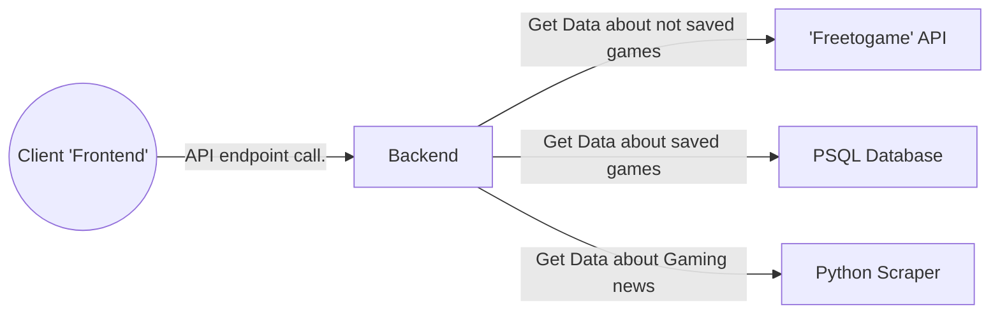

# FAM-backend

This is the backend side for my interesting PET project.  
For the other parts, please use the following links:

## About the project
The project is meant to be a "home page" for my friend group. It contains a News page, where we can find news related to gaming and a "Free game" page, where I use an API to get data from games that are free to play.

## Project structure

Presentation flowchart with a simple request on the backend

## Backend structure

I use Java Spring-boot to manage my backend side. It's a relatively fast and reliable framework for this purpose. Here I tried to follow the Spring Architecture norms, like layers to be a bit more structured.

    
### Controller layer

 

Here are the endpoints for the API in the backend, like the "FreeGameController", where we can reach all games, filtered games or just one specific game  
 
All the endpoints start with "/api/" to better fit for the best practices

### Service layer

Here we can find the "Business logic" for the different endpoints in the application.  
In the following example we get a game by ID
First, we try to get it from the Database and send it if it is saved. If not, then we get it from the 'Freetogame' API with the correct url form, then we save it, parse it to JSON and send it back to the client  

### Repository layer

Because we only save games currently to the Database, therefor we only have a "FreeGameDetailedRepository" to get data from the Database with the help of Hibernate

We transfer data with the help of DTOs ( or Models) and Entitys, like "FreeGame", where we store the short form of the different games until we send it away or process it

